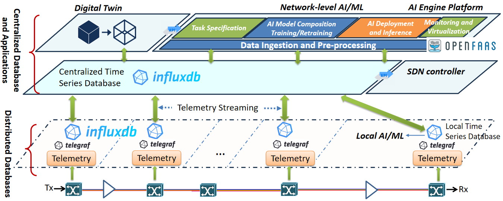

# Unified Telemetry and Monitoring Platform

The **Unified Telemetry and Monitoring Platform** provides an end-to-end solution for collecting, storing, streaming and visualising telemetry data in optical networks.
It integrates **InfluxDB, Apache Kafka, Telegraf, Grafana and Kadeck**, enabling real-time network/device performance monitoring and supporting AI/ML-based applications.

## 📂 Repository Structure

├── voyager.py # Collects monitoring data from Voyagers and saves it into CSV

├── data from voyager to Kafka.txt # Python Kafka Producer: pushes Voyager data to Kafka

├── data from InfluxDB to Kafka.txt # Reads data from InfluxDB and pushes it to Kafka

├── data from Kafka to InfluxDB.txt # Telegraf Config: Pushes data from Kafka to InfluxDB

├── flask_app.txt # Flask app example (receives telemetry data via HTTP)

├── Unified_Telemetry_and_Monitoring_Platform_User_Guide.pdf # User Guide

 

## 🚀 Quick Start

1. **Start Services**
   
      - Install InfluxDB and Kafka (see instructions in the User Guide PDF)
   
      - Start Zookeeper and Kafka broker

3. **Send Data to Kafka**
   
      - python "data from voyager to Kafka.txt" # change voyager to the device that you want to monitor

5. **Consume Data and Write to InfluxDB**

      - Configure Telegraf with "data from Kafka to InfluxDB.txt"

      - Start Telegraf service

4. **Visualise with Grafana**

      - Connect Grafana to InfluxDB

      - Build dashboards for BER, OSNR, CD, and other device metrics

5. **Send Data from the Distributed Databases to the Centralised Database**

      - python "data from InfluxDB to Kafka.txt"

      - Configure Telegraf with "data from Kafka to InfluxDB.txt"
   
      - Start Telegraf service

 

🛠 Features

      📡 Performance monitoring of the physical layer

      🔄 Kafka-based telemetry pipeline

      💾 Distributed and centralised databases supporting local and network-level ML tasks
      
      📊 Data management and streaming visualisation via Grafana and Kadeck

      🤖 Supports two network intelligences: AI engines and digital twins

 

🙌 Acknowledgment

This work is supported by the **European Commission’s Horizon research and innovation program's Allegro project (Grant No. 101092766)**.  

If you use this repository in your research, please cite the following paper:
 
> "**S. Shen et al., "Unified monitoring and telemetry platform supporting network intelligence in optical networks," in Journal of Optical Communications and Networking, vol. 17, no. 2, pp. 139-151, February 2025, doi: 10.1364/JOCN.538552.**"  
> [[https://doi.org/10.1364/JOCN.538552](https://ieeexplore.ieee.org/document/10856707)]

 

📧 If you have any questions or want to have some collaborations, please feel free to contact:

Dr. Shuangyi Yan: shuangyi.yan@bristol.ac.uk

Dr. Sen Shen: sen.shen@bristol.ac.uk

